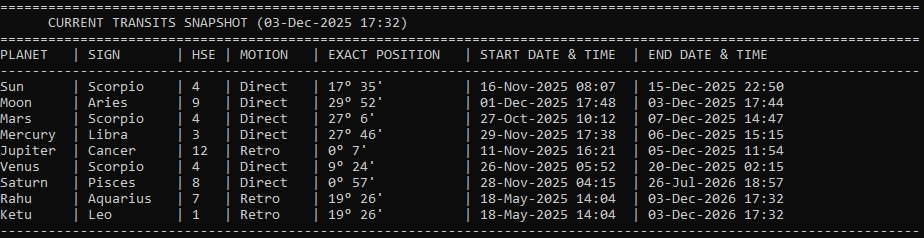

# Vedic Transit Calculator

A precise, terminal-based Python tool for calculating Vedic Astrology planetary transits.

This script utilizes the Swiss Ephemeris (via `pyswisseph`) to calculate exact planetary positions, sign ingresses, and motion changes (Retrograde/Direct) with high astronomical accuracy.

---




---

## Features

* **Calculates Transits:** Generates timelines for sign changes and motion changes (Retrograde/Direct).
* **Vedic Settings:**

  * Ayanamsa: True Chitra Paksha (Lahiri)
  * Nodes: Mean Nodes (Rahu/Ketu)
  * Positions: Geocentric, True positions
* **Customizable Timeframe:** Defaults to ±1 year from the current date
* **Whole Sign Houses:** Calculates house positions based on the selected Ascendant (Lagna)
* **Current Snapshot:** Displays real-time planetary positions at execution

---

## Prerequisites

* Python 3.6+
* `pyswisseph` library

---

## Installation

### Clone the repository

```bash
git clone https://github.com/yourusername/vedic-transit-calculator.git
cd vedic-transit-calculator
```

### Install Dependencies

```bash
pip install pyswisseph
```

### Setup Ephemeris Files

This tool requires Swiss Ephemeris `.se1` files.

1. Create a folder named **ephe** in the project root
2. Download `.se1` ephemeris files from the Swiss Ephemeris download area
3. At minimum, download files covering the years you will calculate (e.g., `sepl_18.se1` for 1800–2400 AD)
4. Place all `.se1` files inside the **ephe** directory

---

## Directory Structure

```
vedic-transit-calculator/
├── ephe/
│   ├── sepl_18.se1
│   ├── semo_18.se1
│   └── ...
├── vedic_transits.py
├── screenshot.png
├── README.md
└── .gitignore
```

---

## Usage

Run the script:

```bash
python vedic_transits.py
```

The script will:

1. Initialize the Swiss Ephemeris
2. Ask you to enter your Ascendant (Lagna) number (`1` = Aries, `5` = Leo, etc.)
3. Generate detailed transit tables for all nine planets
4. Display a current planetary snapshot

---

## License

This project is licensed under the **GNU General Public License v3.0**.
See the **LICENSE** file for details.
